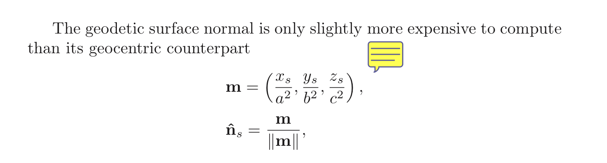
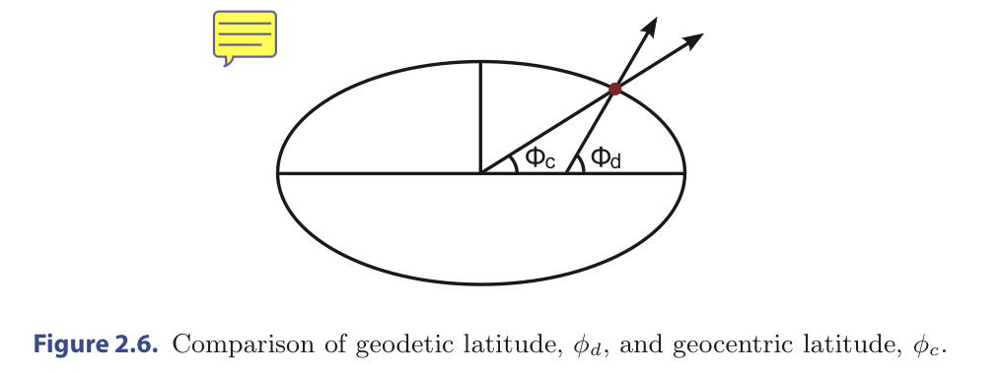

# MathFoundations

This chapter introduces the motivation and mathematics for an ellipsoidal representation of Earth, with a focus on building a reusable Ellipsoid class containing functions for computing surface normals, converting between coordinate systems, computing curves on an ellipsoid surface, and more. 
 
This chapter is unique among the others in that it contains a significant amount of math and derivations, whereas the rest of the book covers more pragmatic engine design and rendering algorithms. You don’t need to memorize the derivations in this chapter to implement a virtual globe; rather, aim to come away with a high-level understanding and appreciation of the math and knowledge of how to use the presented Ellipsoid methods. 
## 2.1 Virtual Globe Coordinate Systems

Virtual globes focus on two coordinate systems: 
&emsp;a. geographic coordinates for specifying positions on or relative to a globe, 
&emsp;b. Cartesian coordinates for rendering. 

TODO: 3DGlobel-- 这里该如何理解？用于 rendering 的话，中间计算怎么办？然后Cesium里的geographic coord是谁？他们之间的互相转换在实际计算的时候如何操作！！！！ 
  中间计算/ ？他们之间的互相转换在实际计算的时候如何操作 ---> 初步结论是将一切三维的点转换到笛卡尔坐标系后，才能用CG的中的仿射变换知识进行空间位置变换如平移旋转缩放 
  然后Cesium里的geographic coord是谁？

### 2.1.1 Geographic Coordinates

a geographic coordinate system defines each position on the globe by an (longitude,latitude,height) - tuple. 
a spherical coordinate system defines each position by an (azimuth, inclination, radius) - tuple. 
 
In OpenGlobe, geographic coordinates are represented using Geodetic 2D and Geodetic3D, the difference being the former does not include height, implying the position is on the surface. 

// TODO: How about in Cesium ???  Geographic Coordinates in Cesium ----》  Cartographic ?

### 2.1.2 WGS84 Coordinate System

Geographic coordinates are useful because they are intuitive—intuitive to humans at least. 
OpenGL uses Cartesian coordinates for 3D rendering. OpenGL doesn’t know what to make of them; 
So We handle this by converting geographic coordinates to Cartesian coordinates for rendering. 
 
The Cartesian system used in this book is called the World Geodetic System 1984 (WGS84) coordinate system. 
This coordinate system is fixed to Earth; as Earth rotates, the system also rotates, and objects defined in WGS84 remain fixed relative to Earth. And the origin is at Earth’s center of mass; the x-axis points towards geographic (0◦, 0◦), the y-axis points towards (90◦, 0◦), and the z-axis points towards the north pole. The equator lies in the xy-plane. 
This is a right-handed coordinate system. 
 
Cartesian coordinates’s X, Y, and Z components are doubles, instead of floats, which are standard in most graphics applications.  **Using meters for units in Cartesian coordinates and for height in geodetic coordinates**, which is common in virtual globes . 
 
the thinking process of the rest content of this chapter: 
ellipsoids => define geographic coordinates precisely => conversion between geographic and WGS84 coordinates 

## 2.2 Ellipsoid Basics
  the Basic concept of Ellipsoid ,oblate spheroids , and sphere.
### 2.2.1 WGS84 Ellipsoid
Earth is not a perfect sphere. 
It is best represented as an oblate spheroid with an equatorial radius of **6,378,137 m**, defining its **semimajor axis**, 
and a polar radius of **6,356,752.3142 m**, defining its **semiminor axis**, 
making Earth about 21,384 m longer at the equator than at the poles. 
This ellipsoid representation of Earth  is called the WGS84 ellipsoid [118]. 
### 2.2.2 Ellipsoid Surface Normals
Computing the outward-pointing surface normal for a point on the surface of an ellipsoid has many uses, including shading calculations and precisely defining height in geographic coordinates. 
 
For a point on a sphere, the surface normal is found by simply treating the point as a vector and normalizing it. 
Doing the same for a point on an ellipsoid yields a **geocentric surface normal**. 
On the other hand, a geodetic surface normal is the actual surface normal to a point on an ellipsoid. 
So: 
&emsp;For a sphere, the geocentric and geodetic surface normals are equivalent. 
&emsp;For more oblate ellipsoids, the geocentric normal significantly diverges from the geodetic normal for most surface points. 
 

### 2.2.3 Geodetic Latitude and Height
( to see th pic to figure out the difference between geodetic latitude and geocentric latitude) 

 
 **Unless stated otherwise in this book, latitude always refers to geodetic latitude.** 
 
**Height should be measured along a point’s geodetic surface normal.** 
Cause the angular difference between geocentric and geodetic normals, Measuring along the geocentric normal introduces error, especially at higher heights. 
The larger the angular difference is, the higher the error. 
The angular difference is dependent on latitude; on the WGS84 ellipsoid, the maximum angular difference between geodetic and geocentric normals is at ≈ 45◦ latitude.  

## 2.3 Coordinate Transformations
Given that **so much virtual globe data are stored in geographic coordinates but are rendered in WGS84 coordinates**, the ability to convert from geographic to WGS84 coordinates is essential. 
Also convert in the opposite direction, from WGS84 to geographic coordinates. 
 
In the following discussion, (longitude, latitude, height)-tuple is denoted by (λ, φ, h).
 
 
下面的内容不写引擎的不必深入了解. 

### 2.3.1 Geographic to WGS84
    Fortunately, converting from geographic to WGS84 coordinates is a straight- forward and closed form.
    R = Rs + h;
    <!-- 这里没懂 geographic 的点是在哪里， WGS84 的点在哪里。。。。。： 两套坐标系，表示的都是 ellipsoid 表面的同一个点，就是两种表示形式而已。 转换的时候通过 geographic 计算出了当前点的 geodetic normal，然后进行计算。具体步骤需要再过。 -->

### 2.3.2 WGS84 to Geographic
    First, we present the simple, closed form conversion for points on the ellipsoid surface.
    Then, we consider scaling an arbitrary WGS84 point to the surface using both a geocentric and geodetic surface normal.
    Finally, we combine the conversion for surface points with scaling along the geodetic surface normal to create a conversion for arbitrary WGS84 points.
    具体步骤？2.4中 用了。
    这里看了，但是数学的东西看不懂，就算了先。已经知道的是：算出来的结果不是那么精准，利用数学推算出来的。
## 2.4 Curves on Ellipsoid
  看书中的 Figure 2.13 就明白了。不清晰顺一下。