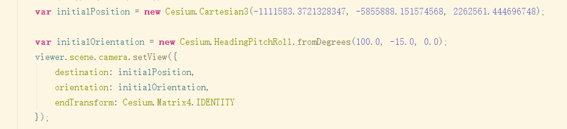

### 关于 heading，pitch，roll

 
注释：
 - center of mass --- 质点
 - 图示为笛卡尔坐标
 - [reference link](https://sites.cs.ucsb.edu/~lingqi/teaching/resources/GAMES101_Lecture_04.pdf)//在第9页 

其中：
  - pitch 是围绕X轴旋转，也叫俯仰角 
  
  - yaw 是围绕 Y 轴旋转，也叫偏航角 
  
  - roll 是围绕 Z 轴旋转，也叫翻滚角 
  

### 示例代码：[reference link](https://www.pianshen.com/article/59611147769/)

由此我们可以看到，在Cesium中，HeadingPitchRoll确定了物体的方向。 
通过以上代码，我们看到，使用Cartesian3确定了坐标，HeadingPitchRoll确定方向，这样我们就能可以在精确的镜头视角下看到该实体的空间情况。

### 相关源代码
 
关于为什么都转换成弧度：Cesium目前支持两种坐标系WGS84和WebMercator，但是在Cesium中没有实际的对象来描述WGS84坐标，都是以弧度的方式来进行运用的也就是Cartographic类。[link](https://www.cnblogs.com/matanzhang/p/11846929.html)