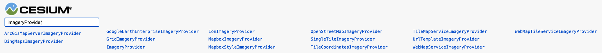

# **Cesium 自学**

## 写这个文档的初衷
&emsp;将学习 Cesium 的过程做一个记录
## [Cesium 基本使用](Cesium_basic.md)

## [Cesium 整体架构介绍](Cesium_architecture.md)

## [Cesium 源码分析初步](Cesiumm_sourceCode_analyse.md)
## 之后如何进行

 <!-- 07.23： 结合当前需求，及时间、任务的安排，决定按照 Cesium 官方中文教程中的案例进行学习。先学习如何应用，然后去阅读源码，并理解为如何生效。 -->
> 参考：
> [Cesium中文网教程](http://cesium.coinidea.com/guide/%E6%96%B0%E6%89%8B%E5%85%A5%E9%97%A8%E4%B8%AD%E6%96%87%E6%95%99%E7%A8%8B/Cesium%E5%85%A5%E9%97%A88%20-%20Configuring%20the%20Scene%20-%20%E9%85%8D%E7%BD%AE%E8%A7%86%E7%AA%97/)

1. Cesium介绍
2. Cesium环境搭建
3. Cesium目录框架结构
4. 创建 Cesium Viewer <br/>
    [如上](#cesium-从-0-到-1)
5. Cesium ion <br/>
    [Cesium入门5 - Cesium ion](http://cesium.coinidea.com/guide/%E6%96%B0%E6%89%8B%E5%85%A5%E9%97%A8%E4%B8%AD%E6%96%87%E6%95%99%E7%A8%8B/Cesium%E5%85%A5%E9%97%A85%20-%20Cesium%20ion/)
6. Adding Imagery - 添加涂层
  Cesium应用程序另一个关键元素是Imagery(图层) <br/>
  瓦片图集合根据不同的投影方式映射到虚拟的三维数字地球表面。 <br/>
  依赖于相机指向地表的方向和距离，Cesium会去请求和渲染不同层级的图层详细信息。 <br/>
   <br/>
  多种图层能够被添加、移除、排序和适应到Cesium中。 <br/>
   <br/>
  Cesium提供了一系列方法用于处理图层，比如颜色自适应，图层叠加融合。一些样例代码如下： <br/>
  - Adding basic imagery添加基本图层 <br/>
  内部图层有关类：
    <!--  -->
    - ArcGisMapServerImageryProvider
    - BingMapsImageryProvider
    - GoogleEarthEnterpriseImageryProvider
    - GridImageryProvider
    - ImageryProvider
    - MapboxImageryProvider
    - MapboxStyleImageryProvider
    - OpenStreetMapImageryProvider
    - SingleTileImageryProvider
    - TileCoordinatesImageryProvider
    - TileMapServiceImageryProvider
    - UrlTemplateImageryProvider
    - WebMapServiceImageryProvider
    - WebMapTileServiceImageryProvider
    - IonImageryProvider //*  Cesium 1.83 中的<font color="red">**默认图层**</font> --- in ---> Source/Scene/createWorldImagery.js
      ```
      function createWorldImagery(options) {
        options = defaultValue(options, defaultValue.EMPTY_OBJECT);
        var style = defaultValue(options.style, IonWorldImageryStyle.AERIAL_WITH_LABELS);//ROAD);//AERIAL);
        return new IonImageryProvider({
          assetId: style,
        });
      }
      ```

      接受一个 options 对象作为参数，
        其中，assiId 必传，包括三个被选值：
        | key                  |    value    |      功能      |
        | :---                 |    :----:   |          ---: |
        | AERIAL               |     2       | Aerial imagery - 航拍图像   |
        | AERIAL_WITH_LABELS   |     3       | Aerial imagery with a road overlay - 会在 Aerial 的基础上添加 地点名称      |
        | ROAD                 |     4       | Roads without additional imagery - 只显示 road      |

      显示创建：
      ```
      //默认BING影像地图
      var viewer = new Cesium.Viewer('cesiumContainer', {
          imageryProvider: Cesium.createWorldImagery({
              style: Cesium.IonWorldImageryStyle.AERIAL
          }),
          baseLayerPicker: false
      });
      ```

  - Adjusting imagery colors自适应图层颜色 <br/>
  - Manipulating and ordering imagery layers控制调整图层顺序 <br/>
  - Splitting imagery layers切割图层 <br/>


