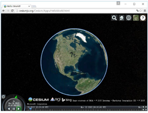
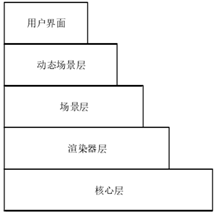
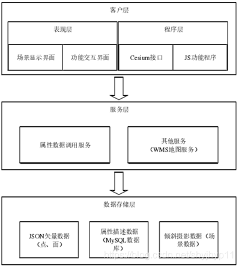
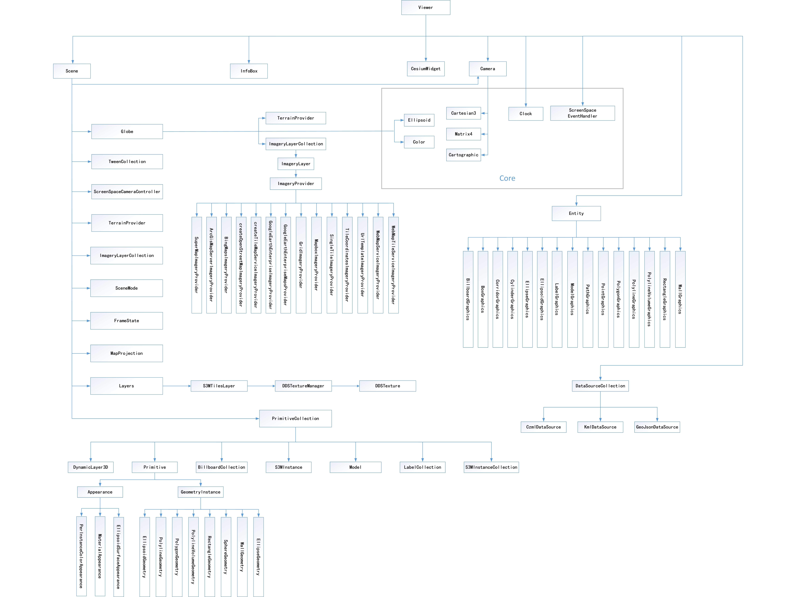
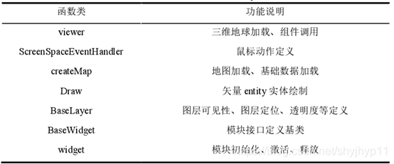
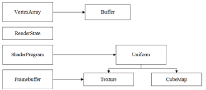

> 版权声明：本文为CSDN博主「惊鸿一博」的原创文章，遵循CC 4.0 BY-SA版权协议，转载请附上原文出处链接及本声明。 
> 原文链接：https://blog.csdn.net/shyjhyp11/article/details/118496780

1. 整体介绍

    Cesium正式发布于 2014 年，是一个完全开源的基于 WebGL 的 JavaScript框架，无需安装插件即可创建具有最佳性能、精度、视觉质量和易用性的世界级三维地球影像和地图，并且具有丰富的开源社区内容。 Cesium 作为一个较为年轻的三维可视化框架，在数字地球项目的应用上有着巨大的优势，其具有以下 3 点特性：

    （1）支持多种视图

        能够以 2D、2.5D 和 3D 形式对地图进行展示，并且无需分别编写代码。

    （2）支持地理信息数据动态可视化

     - 能够使用时间轴动态展示具有时间属性的数据。
     - 能够使用符合 [OGC](https://www.osgeo.org/partners/ogc/) 标准的 [WMS](https://www.ogc.org/standards/wms)、 [WMTS](https://www.ogc.org/standards/wmts)等多种地图服务，并且通过 流式 传输图像和全球地形。
     - 能够通过加载 KML、GeoJSON 等格式的数据绘制矢量图形。
     - 支持加载 [3D Tiles](https://www.jianshu.com/p/d13d895f2024) 和 [glTF 格式](https://www.khronos.org/gltf/)的三维模型，其中 3D Tiles 可以加载点云、倾斜摄影等大规模模型数据。([glTF -in Cesium](https://www.cnblogs.com/fuckgiser/p/6266552.html))

    （3）高性能和高精度的内置方法

      - 对 WebGL 进行优化，充分利用硬件加速功能，使用底层渲染方法进行可视化。
      - 提供了可以绘制大型折线、多边形、广告牌、标签等的 API。
      - 提供了可以控制摄像头和创造飞行路径等的坐标、向量、矩阵运算方法。
      - 提供了可以控制时间轴等组件的动画控件。

2. Cesium 框架

  目前， 市面上较流行的三维 WebGIS 类库有 ArcGISAPI for JavaScript 4．x 系列、Cesium 等。
  ArcGIS API forJavaScript 4. x 系列为 Esri 公司基于 WebGL 与 HTML5 技术开发，但其调用的三维场景资源数据格式小众， 需借助 ArcGIS Pro 发布， 且为付费软件。
  Cesium 是 AGI 公司于 2011 年开发的一款支持 Web GL 的免费 JavaScript 库函数，它能够在不添加插件的情况下基于多种浏览器和 mobile 进行网页端的可视化展示，其框架页面如下图所示。   

  &emsp;&emsp;&emsp;   

  地图能够以二维、三维的形式进行展示，同时支持调用 [OGC（Open Geospatial Consortium）地理信息联盟](https://www.osgeo.org/partners/ogc/)指定的空间数据服务规范下的 [WMS](https://www.ogc.org/standards/wms)、[WMTS](https://www.ogc.org/standards/wmts)、[ArcGIS](https://enterprise.arcgis.com/zh-cn/server/latest/publish-services/linux/ogc-support-in-arcgis-server.htm)等多种地图服务图层
  三维球体上能够进行点、线、面、体等实体的创建、glTF/glb 三维模型的加载以及基于时间轴进行动画模拟等的动态效果等其他功能实现，Cesium 于 2016 年推出了 3D Tiles 格式规范后，三维地球也能够支持对 [倾斜摄影](https://blog.csdn.net/wangbiao9292/article/details/93499988)、[点云](https://blog.csdn.net/qq_42899245/article/details/116521688)等大型模型数据的加载。([**附**：WFS,WMS,WMTS 简单对比,并结合OGC的使用说明](https://doc.arcgis.com/zh-cn/arcgis-online/reference/ogc.htm))。

  Cesium 按照其功能层级不同，由下到上可主要分为核心层、渲染器层、场景层和动态场景层四层。

  &emsp;&emsp;&emsp;

       - 核心层：提供基本的数学运算法则，如投影、坐标转换、各种优化算法等；
       - 渲染器层：对 WebGL 进行封装，其包括了内置 GLSL 功能、着色器的表示、纹理、渲染状态等；
       - 场景层：主要体现为多种数据源服务图层的加载、实体构建、模型加载及相机视角等一系列场景的构建等；
       - 动态场景层：对 GeoJSON 等矢量数据进行解析构建动态对象，从而实现场景实时、动态渲染效果；

  1. Cesium 系统架构

      本地 Cesium 系统架构采用流行的  ***B/S（浏览器/服务器）*** 架构方式。  
      根据各个层次实现的功能的不同，系统整体可分为客户层、服务层以及数据存储层三个层次。

      &emsp;&emsp;&emsp;

      - 客户层

        客户层的表现是以网页形式对系统整体实现在各种主流浏览器端展示，同时通过 HTML5 和 CSS3 文件实现网页内容充实和网页样式的调整和设计。 
        也即 将项目在各个浏览器内部成功展示，并成功附带相应功能和样式。 
        因此，客户层的模块整体可分为三个方面：

        - 一是： 三维场景的显示， 主要体现在三维模型及各种矢量实体的加载及其他可视化效果的呈现，同时包括对地球本身的鼠标动作响应等基本操作；
        - 二是： 用户对图层工具的操作界面，用于实现基于地球或者模型的可视化功能；
        - 三是： 使用 JavaScript 语言提供的各个 JS 功能文件及模块接口，例如 Cesium 框架提供基础的三维可视化场景、jQuery-Ajax 提供对网页内容的局部刷新效果以及通过编写的 JS 文件实现地图底图的更换、工具及需求功能的可视化实现等。

      - 服务层

        服务层是 B/S 架构方式重要的一环，本次实验的服务层部署采用的是 Node.js 运行环境以及基于 Node 的 Web 端开发框架 Express。

        服务层的作用主要在于通过服务器的监听端口接收来自客户端的不同 HTTP 请求，根据这些不同请求向数据存储端查找相应数据并响应给用户，通过服务端的中转可以有效地实现客户端与数据端的信息传递。

      - 数据存储层

        数据存储层主要负责对客户端需求查找的数据进行存储。

        本次实验
          - 一方面采用
           [ ] Geojson 数据格式将全景点记属性信息及矢量面属性信息存储在服务器中的静态文件夹中；
          - 另一方面则采用关系型数据库 MySQL 对中国矿业大学的地物属性描述信息进行存储。

  2. Cesium 类的层次结构

     &emsp;&emsp;&emsp;

     其中一些关键函数类，对其解释说明如下所示:

      &emsp;&emsp;&emsp;

      - Viewer：Cesium 的基础类也是核心类，一方面定义 viewer 对象在 HTML 创建的关联 ID 的 div 元素中创建一个虚拟三维球体，地图添加、模型加载、实体创建及功能的实现都基于此 div，另外的功能则是基于原生 Cesium 的诸如fullscreenButton、vrButton、infoxBox 等相关组件调用实现。
      - ScreenSpaceEventHandler：响应鼠标点击事件，通过对鼠标定义左、右键或者双击等方式为鼠标动作创建一个监听，通过 pick 屏幕坐标位置获取到添加实体或矢量，实现诸如高亮等功能；
      - createMap(options)：创建地图的静态类，通过 options 的参数传入，从config.json  中获取到图层数据配置信息，从 HTML 文件中获取到 div 容器，从而实现地球地图数据的加载，并完成 Cesium  一些需求控件的加载；
      - Draw：一个用于绘制实体的类，提供了文字、点、线、面、体以及 gl TF/glb模型等的 entity 对象的绘制，通过 options 参数创建标绘控制器实现 entity 编辑时的一些状态和动作，并对相应实体的类型和风格信息进行自定义设置；
      - BaseLayer：是控制处理所有图层的基类，可用于设置图层是否可见、图层定位到指定视角区域及透明度等；
      - BaseWidget：Widget 模块的基础类，在进行 Widget 模块开发时，需要在继承该类的基础上新建类，用于提供该 Widget 能够被外部调用的接口；
      - widget：静态类，用于统一组织管理 Widget 模块，根据该类提供的方法，可进行模块初始化和对指定 Widget 模块进行激活、释放操作。

  3. Cesium 内部渲染器结构

      Cesium 作为一款虚拟仿真开源库，其堆栈结构按层级划分为三层，包括 Primitives、Scene、Renderer。

      除了这三层外还有底层核心层. 核心层主要包括了与数学原理相关的功能，包括矩阵运算、地理坐标系与笛卡尔坐标系之间的转换、动态投影、曲面细分等算法。

      **Primitives** 主要包括 Globe、Model、Primitive、Labels、ViewportQuad。

        - Globe 包括地形引擎，主要包括含有细节层次的地形及影像数据；
        - Model 是满足 glTF 规范的三维模型数据；
        - Primitive 主要是呈现异构的可批处理的几何要素以及纹理；
        - Labels 指标签，顾名思义就是在虚拟地球上添加标识等识别标签；
        - ViewportQuad 主要用于屏幕空间渲染。

      Cesium 在运行实例时，需要使用着色器管道来生成着色器，以及一个包含 uniform单元与函数的 GLSL 库， **Renderer** 对 WebGL 相关功能进行了封装，这样做的目的是比直接使用 WebGL 更易于使用。Cesium 图形渲染器架构如图所示。

      &emsp;&emsp;&emsp;

      //* 图中英文单词注解：
        - Vertex - 顶点，结合WebGL的基础知识，所有的模型都是由三角形拼凑而成的，所以需要知道顶点；
        - Buffer - 缓冲区，在Node.js中定义的一个专门存放二进制数据的缓冲区；
        - Shader - webGL 中的 着色器，具体包括 vertex shader(顶点着色器) 和 fragment shader(片元着色器) ；
        - Uniform - webGL 中的 一种变量类型，用于和GPU或其他硬件进行数据传输。在 webGl中，此变量类型只能在 片元着色器 中进行使用

       
      **Scene** 提供了高级的虚拟地球地图功能，通过解析相关符合规范的数据，在数据驱动下创建对象并进行动态可视化，对象将在场景中由可视化相关类按照帧数进行实时渲染，从而完成整个仿真环境的动态渲染。

3. 文章内部参考

  > [赵慧峰. 基于Cesium的三维展示与查询平台开发[D].中国矿业大学,2019.(在线阅读链接)](https://kreader.cnki.net/Kreader/CatalogViewPage.aspx?dbCode=cdmd&filename=1019604706.nh&tablename=CMFD201902&compose=&first=1&uid=WEEvREcwSlJHSldTTEYzVDhUQ05aaVQzdCszSDU0QXNQRVZISmJHVG1SMD0=$9A4hF_YAuvQ5obgVAqNKPCYcEjKensW4IQMovwHtwkF4VYPoHbKxJw!!)

  > [韩昕熠. 基于Cesium的多维动态可视化技术研究[D].西安科技大学,2019.(在线阅读链接)](https://kreader.cnki.net/Kreader/CatalogViewPage.aspx?dbCode=cdmd&filename=1019618903.nh&tablename=CMFD202001&compose=&first=1&uid=WEEvREcwSlJHSldTTEYzVDhUQ05aaVQzdCszSDU0QXNQRVZISmJHVG1SMD0=$9A4hF_YAuvQ5obgVAqNKPCYcEjKensW4IQMovwHtwkF4VYPoHbKxJw!!)

  > [王恒,江丽钧,段雪娇.基于Cesium的地方大地测量数据库平台设计[J].北京测绘,2020,34(02):194-198.(对应的链接只是知网链接,不可在线阅读。 另： 北京测绘有一些其他的关于 Cesium 的文章有机会记录一波)](https://kns.cnki.net/kcms/detail/detail.aspx?dbcode=CJFD&dbname=CJFDLAST2020&filename=BJCH202002013&v=UeL41cA3v9Nglz8xaiij3C5FSfFPZmv5pfVsnGHmuYfczDFdkaCn5l7eWcgem4Tw&uid=WEEvREcwSlJHSldTTEYzVDhUQ05aaVQzdCszSDU0QXNQRVZISmJHVG1SMD0=$9A4hF_YAuvQ5obgVAqNKPCYcEjKensW4IQMovwHtwkF4VYPoHbKxJw!!)

  > [cesium结构图(一个网页链接)](https://blog.csdn.net/xiaowanzi29/article/details/84762378)