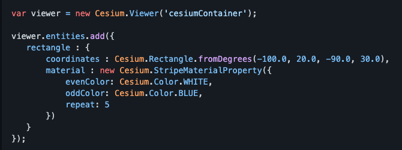
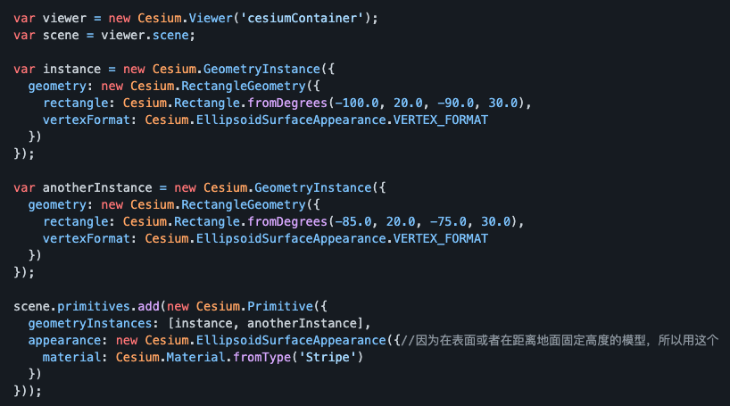

- [Point](./Primitive_vs_Entity_demo/Point.md)
- [rectangle](./Primitive_vs_Entity_demo/Rectange.md)

|  ----  |  表头   | 表头  |
|  ----  |  ----  | ----  |
|  示例代码  |   |  |
|  生效流程  | 单元格  | 单元格 |
|  入参分析  | 单元格  | 单元格 |

