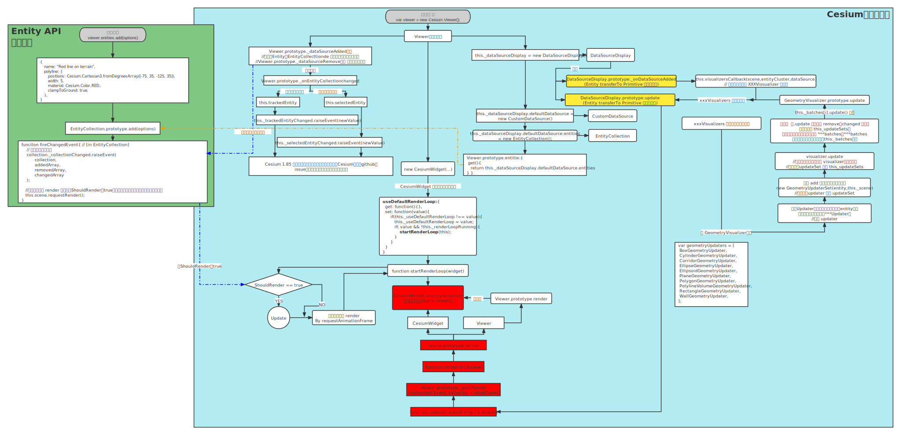

>[reference link ](https://www.cnblogs.com/onsummer/p/14059204.html)

|  ----  |  Entity API   | Primitives API  |
|  ----  |  ----  | ----  |
|  示例代码  |   |  |
|  构建方式  | Entity 用的是 Graphic，参数化创建图形，并可以参数符号化，几何形状和外观耦合在一起  | Primitive 用的是 Geometry + Appearance，可以分别修改几何形状和外观。虽然有预定义的 Geometry，但是 Primitive API 提供的是更接近 WebGL 的接口，构造 Geometry 完全可以使用与 WebGL 十分接近的逻辑，传入顶点、法线等素材创建难以想象的形状。 |
|  生效流程  |    |   |
|  时间插值  | Entity 拥有 Property 进行时间插值  | Primitive 没有时间插值，需要深入着色器 |
|  性能  |  Entity 在数据量特别大的情况下性能比 Primitive 差  | ----  |
|  案例代码  |  [Point](./Primitive_vs_Entity_demo/Point.md)，[Rectangle](./Primitive_vs_Entity_demo/Rectange.md) 【附上了流程图对应的pos格式文件，可以通过Process web端和移动端打开[文件位置](./ProcesssOn)】|

