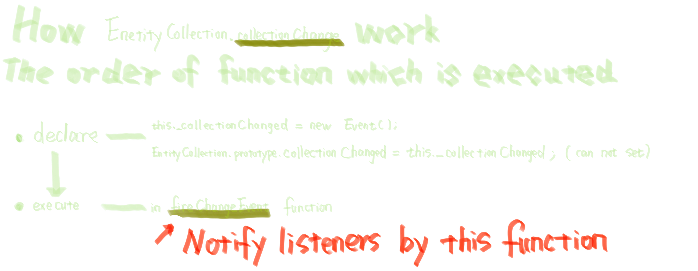

## 结论



## 当前文件路径：cesium/Source/DataSources/EntityCollection.js

```js
Object.defineProperties(EntityCollection.prototype, {
  collectionChanged: {
    get: function () {
      return this._collectionChanged;//was declared when initialization of EntityCollection
    },
  },

  ...

});
```

<br/>
<br/>
<br/>

```js
function EntityCollection(owner) {

  this._collectionChanged = new Event();//! was used in function fireChangedEvent only only only

  ...

}
```
<br/>
<br/>
<br/>

```js
/*
  this fireChangedEvent function will be call in function below;
    EntityCollection.prototype.resumeEvents
    EntityCollection.prototype.add
    EntityCollection.prototype.removeById
    EntityCollection.prototype.removeAll
    EntityCollection.prototype._onEntityDefinitionChanged
*/
/*

*/
function fireChangedEvent(collection) {
  if (collection._firing) {// 默认false ---> 什么 时候变成 true？--- 这个变量只在当前函数内部使用
    collection._refire = true;// 默认false
    return;
  }

  if (collection._suspendCount === 0) {//默认 0 ； 在 Entity.prototype.suspendEvents 中 ++，  在 Entity.prototype.suspendEvents 中 --
    var added = collection._addedEntities;
    var removed = collection._removedEntities;
    var changed = collection._changedEntities;
    if (changed.length !== 0 || added.length !== 0 || removed.length !== 0) {//在最初初始化的时候是都为 0 的
      collection._firing = true;
      do {
        collection._refire = false;
        var addedArray = added.values.slice(0);
        var removedArray = removed.values.slice(0);
        var changedArray = changed.values.slice(0);

        added.removeAll();
        removed.removeAll();
        changed.removeAll();

        collection.'_collectionChanged'.raiseEvent( collection, addedArray, removedArray, changedArray );

      } while (collection._refire);

      collection._firing = false;
    }
  }

}
```

### **<font color=red>从 EntityCollection.prototype.add 入手研究 fireChangedEvent 到底干了什么</font>**

```js
EntityCollection.prototype.add = function (entity) {
  //>>includeStart('debug', pragmas.debug);
  if (!defined(entity)) {
    throw new DeveloperError("entity is required.");
  }
  //>>includeEnd('debug');

  if (!(entity instanceof Entity)) {
    entity = new Entity(entity);
  }

  var id = entity.id;
  var entities = this._entities;
  if (entities.contains(id)) {
    throw new RuntimeError(
      "An entity with id " + id + " already exists in this collection."
    );
  }

  entity.entityCollection = this;
  entities.set(id, entity);

  if (!this._removedEntities.remove(id)) {//返回值是Boolean，代表 this._removedEntities 中是否存在 对应 id 的 Entity，如果存在，会在函数内部执行删除操作
    this._addedEntities.set(id, entity);
  }

  //entity.definitionChanged = new Event();   ～.addEventListener(listener,scope) ---return removeListener function
  entity.definitionChanged.addEventListener(
    EntityCollection.prototype._onEntityDefinitionChanged,
    this
  );
  // entity.definitionChanged.raiseEvent was executed in Entity's function below

  fireChangedEvent(this);
  return entity;
};
```

```js
EntityCollection.prototype._onEntityDefinitionChanged = function (entity) {
  var id = entity.id;
  if (!this._addedEntities.contains(id)) {
    this._changedEntities.set(id, entity);
  }
  fireChangedEvent(this);
};
```

## 当前文件路径： cesium/Source/DataSources/Entity.js ---- aimed to know entity.definitionChanged.raiseEvent,and then to analyse WHY things goes in this way

```js

function updateShow(entity, children, isShowing) {
  var length = children.length;
  for (var i = 0; i < length; i++) {
    var child = children[i];
    var childShow = child._show;
    var oldValue = !isShowing && childShow;
    var newValue = isShowing && childShow;
    if (oldValue !== newValue) {//这里一定和传进来的数据组织关系有关系，回头打个断点
      updateShow(child, child._children, isShowing);
    }
  }

  entity.'_definitionChanged'.raiseEvent( entity, "isShowing", isShowing, !isShowing );//看代码 对应的事件发布者 EntityCollection.prototype._onEntityDefinitionChanged 只接收 entity 一个参数，传这么多干啥用呢？还是说我代码找错了？
}

Object.defineProperties(Entity.prototype, {
  definitionChanged: {
    get: function () {
      return this._definitionChanged;
    },
  },
  show: {
    get: function () {
      return this._show;
    },
    set: function (value) {
      //>>includeStart('debug', pragmas.debug);
      if (!defined(value)) {
        throw new DeveloperError("value is required.");
      }
      //>>includeEnd('debug');

      if (value === this._show) {
        return;
      }

      var wasShowing = this.isShowing;
      this._show = value;
      var isShowing = this.isShowing;

      if (wasShowing !== isShowing) {
        updateShow(this, this._children, isShowing);
      }

      this.'_definitionChanged'.raiseEvent(this, "show", value, !value);
    },
  },
  parent: {
    get: function () {
      return this._parent;
    },
    set: function (value) {
      var oldValue = this._parent;

      if (oldValue === value) {
        return;
      }

      var wasShowing = this.isShowing;
      if (defined(oldValue)) {
        var index = oldValue._children.indexOf(this);
        oldValue._children.splice(index, 1);
      }

      this._parent = value;
      if (defined(value)) {
        value._children.push(this);
      }

      var isShowing = this.isShowing;

      if (wasShowing !== isShowing) {
        updateShow(this, this._children, isShowing);
      }

      this.'_definitionChanged'.raiseEvent(this, "parent", value, oldValue);
    },
  },

  // properties needed are listed below
  isShowing: {
    get: function () {
      return (
        this._show &&
        (!defined(this.entityCollection) || this.entityCollection.show) &&
        (!defined(this._parent) || this._parent.isShowing)
      );
    },
  },
});

// properties needed are listed below
function Entity(options) {
  this._show = defaultValue(options.show, true);
  ...
}


```