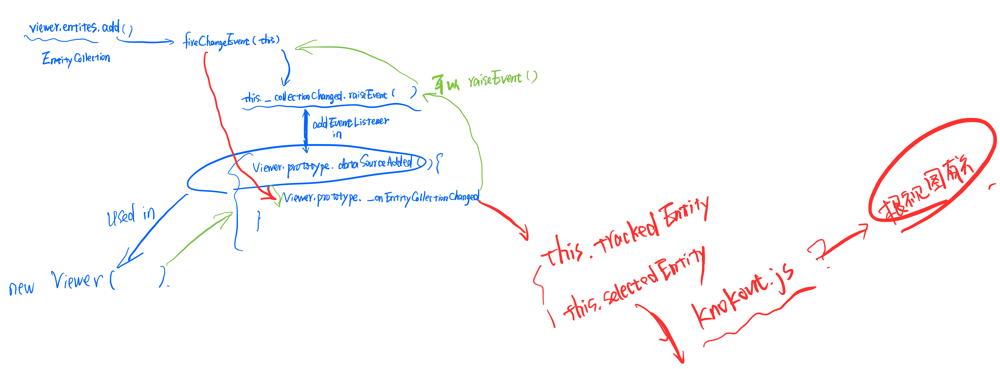

# <font color=red>The reason why i write this: i want to know how it works with Primitive API</font>

# Beginning

```js
var viewer = new Cesium.Viewer('cesiumContainer');

viewer.entities.add({
   rectangle : {
       coordinates : Cesium.Rectangle.fromDegrees(-100.0, 20.0, -90.0, 30.0),
       material : new Cesium.StripeMaterialProperty({
           evenColor: Cesium.Color.WHITE,
           oddColor: Cesium.Color.BLUE,
           repeat: 5
       })
   }
});
```

# End

成功<font color=red>添加</font> 图元 及相关操作, 并<font color=red>渲染</font>成功
<br>
<br>

# Process from Beginning to End

<!--（这个言论不咋对） Cesium.Viewer 在 Cesium.Widget 的基础上添加了很多操作事件，和对 Widget 内部一些事件的调用，最终还是将 primitives 添加到了 Widget 内部 的 Scene 中？ -->

每一个 Entity 放到 EntityCollection 里的时候，都会对应有一个 collectionChanged (instance of Event)里的对应的事件，
当 执行 EntityCollection内部的 fireChangedEvent 方法时，会执行且仅在此处执行 collectionChanged.raiseEvent(...).
具体代码： ```collection._collectionChanged.raiseEvent(collection, addedArray, removedArray, changedArray);```<br>
而 collectionChanged.addEventListener 在 Viewer 内部实现，具体位置是 #1739(add)，#1753(remove)。<br>
其中:<br>
&emsp;add,remove 对应的方法都是 [Viewer.prototype._onEntityCollectionChanged](#viewerprototype_onentitycollectionchanged), 这个方法 做了两件事：<br>
&emsp;&emsp;A- 修改 [this.trackedEntity](#viewertrackedentity)<br>
&emsp;&emsp;&emsp;--- 当前相机跟踪的 Primitive/Entity（拦截器属性，有set对应的代码块）<br>
&emsp;&emsp;&emsp;--- 实际操作的是 this._trackedEntity<br>
&emsp;&emsp;&emsp;--- 存在this._trackedEntityChanged 并且会在 set 时执行<br>
&emsp;&emsp;&emsp;--- set 时执行：<br>
&emsp;&emsp;&emsp;&emsp;---- this._trackedEntityChanged.raiseEvent(value);<br>
&emsp;&emsp;&emsp;&emsp;---- 最后这句：this.scene.requestRender(); 的作用就是: this._renderRequested = true; ==》 在Scene.prototype.render 中用于判断 shouldRender 的值( [about why the problem was converted to the update function](../0_TO_1_about/index_entities_add.md#firechangedevent) ) <br>
&emsp;&emsp;B- 修改 [this.selectedEntity](#viewertrackedentity)<br>
&emsp;&emsp;&emsp;---  当前选中的 Primitive/Entity（拦截器属性，有set对应的代码块）<br>
<br>
  此外： this._trackedEntity, this._selectedEntity 都通过 knockout 变成 响应式的属性，及会根据页面数据的变化实时进行 get/set。<br>

  ```js
    knockout.track(this, [
      "_trackedEntity",
      "_selectedEntity",
      "_clockTrackedDataSource",
    ]);
  ```


视图更新关键函数：
  - [fireChangedEvent](#firechangedevent)

最终的关键属性:

  - [this.trackedEntity( mainly )](#viewerprototypetrackedentity)
  - [this.selectedEntity](#viewerprototypeselectedentity)

相关细节：[for detail](../0_TO_1_about/index_entities_add.md), <font color=red>但是就目前发现的内容，和 Primitive API 没有一毛钱关系啊！！！(还是需要看 Primitive API相关内容，0816)</font>

<br/>



<br/>
<br/>

# Related code


## Viewer.prototype._onEntityCollectionChanged

```js
/**
 * @private
 */
Viewer.prototype._onEntityCollectionChanged = function ( collection, added, removed ) {
  var length = removed.length;
  for (var i = 0; i < length; i++) {
    var removedObject = removed[i];
    if (this.trackedEntity === removedObject) {
      this.trackedEntity = undefined;
    }
    if (this.selectedEntity === removedObject) {
      this.selectedEntity = undefined;
    }
  }
};
```

## Viewer.trackedEntity

```js
  /**
   * Gets or sets the Entity instance currently being tracked by the camera.
   * @memberof Viewer.prototype
   * @type {Entity | undefined}
   */
  trackedEntity: {
    get: function () {
      return this._trackedEntity;
    },
    set: function (value) {
      if (this._trackedEntity !== value) {
        this._trackedEntity = value;

        //Cancel any pending zoom
        cancelZoom(this);

        var scene = this.scene;
        var sceneMode = scene.mode;

        //Stop tracking
        if (!defined(value) || !defined(value.position)) {
          this._needTrackedEntityUpdate = false;
          if (
            sceneMode === SceneMode.COLUMBUS_VIEW ||
            sceneMode === SceneMode.SCENE2D
          ) {
            // * If true, allows the user to pan around the map.  If false, the camera stays locked at the current position.
            //* This flag only applies in 2D and Columbus view modes.
            scene.screenSpaceCameraController.enableTranslate = true;
          }

          if (
            sceneMode === SceneMode.COLUMBUS_VIEW ||
            sceneMode === SceneMode.SCENE3D
          ) {
            //* If true, allows the user to tilt the camera.  If false, the camera is locked to the current heading.
            //* This flag only applies in 3D and Columbus view.
            scene.screenSpaceCameraController.enableTilt = true;
          }

          // 只有在函数 updateTrackedEntity 中会被赋值，viewer._entityView = new EntityView(...)，
          //紧接着跟了一句 viewer._entityView.update ---》 * Should be called each animation frame to update the camera
          this._entityView = undefined;

          // * Sets the camera position and orientation using a target and transformation matrix.
          this.camera.lookAtTransform(Matrix4.IDENTITY);

        } else {
          //We can't start tracking immediately, so we set a flag and start tracking
          //when the bounding sphere is ready (most likely next frame).
          this._needTrackedEntityUpdate = true;
        }

        this._trackedEntityChanged.raiseEvent(value);//?????
        this.scene.requestRender();// change this._renderRequested to true , aiming to set the value of shouldRender in function Scene.prototype.render to true, in another words, in order to requests a new rendered frame
      }
    },
  },
```

## Viewer.selectedEntity

```js
  /**
   * Gets or sets the object instance for which to display a selection indicator.
   *
   * If a user interactively picks a Cesium3DTilesFeature instance, then this property
   * will contain a transient Entity instance with a property named "feature" that is
   * the instance that was picked.
   * @memberof Viewer.prototype
   * @type {Entity | undefined}
   */
  selectedEntity: {
    get: function () {
      return this._selectedEntity;
    },
    set: function (value) {
      if (this._selectedEntity !== value) {
        this._selectedEntity = value;
        var selectionIndicatorViewModel = defined(this._selectionIndicator)
          ? this._selectionIndicator.viewModel
          : undefined;
        if (defined(value)) {
          if (defined(selectionIndicatorViewModel)) {
            selectionIndicatorViewModel.animateAppear();
          }
        } else if (defined(selectionIndicatorViewModel)) {
          // Leave the info text in place here, it is needed during the exit animation.
          selectionIndicatorViewModel.animateDepart();
        }
        this._selectedEntityChanged.raiseEvent(value);
      }
    },
  },
```

