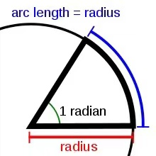
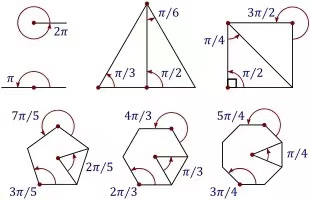
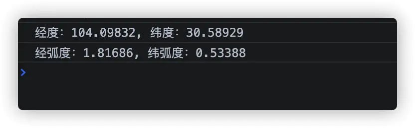

# Cesium 中的坐标系

#### 为什么要知道坐标系
Cesium项目中经常涉及到模型加载、定位、预览都需要用到坐标系，弄明白Cesium中采用的坐标系以及各个坐标系之间的转换，是做三维GIS场景的前提。
举个例子：Cesium中的模型运动本质上就是每个单位时间内模型的position发生变化。在处理 **position** 的变化时，就需要用到。
#### info
Cesium中常用的坐标有两种：
- WGS84地理坐标系
  - WGS84经纬度坐标系 ： 就是通俗的地图地理坐标经纬度。
  - WGS84弧度坐标系（Cartographic）： 在数学上被称为球坐标系。
    ```js
     // 使用方法
     new Cesium.Cartographic(longitude, latitude, height)
     // longitude：经度（in radian）
     // latitude：纬度（in radian）
     // height：当前点距椭球上方的高度（in meter）
    ```
    - 返回值：是一个球坐标类型（这个词儿，不好理解和接受。。。）
      - 
    - 弧度和角度的转换公式 ( 1度 = π/180 )
      - 角度转弧度 π/180×角度
      - 弧度变角度 180/π×弧度
      - 例子：
        - 
    - 关于弧度/radian[radius--半径]：弧度即角度对应弧长
      - 
      - 
- 笛卡尔空间坐标系
  - 平面坐标系： 平面坐标系也就是平面直角坐标系，是一个二维笛卡尔坐标系。可对比 [Canvas坐标系理解](#canvas坐标系)
    ```js
      new Cesium.Cartesian2(x, y)
      // return A 2D Cartesian point.
      // 每个参数是什么意思？ 什么单位？ ---//!
      // x: Number.  The X component.
      // y: Number.  The X component.
    ```
    - 返回值
      - 
  - 空间直角坐标系： 笛卡尔空间坐标的原点就是椭球的中心。<font size=2>我们在计算机上进行绘图时，不方便使用经纬度直接进行绘图，一般会将坐标系转换为笛卡尔坐标系，使用计算机图形学中的知识进行绘图</font>
    ```js
      new Cesium.Cartesian3 ( x , y , z )
      // return A 3D Cartesian point.
      // 每个参数是什么意思？ 什么单位？ ---//!
      // x: Number.  The X component.
      // y: Number.  The X component.
      // z: Number.  The X component.
    ```
- 坐标系转换
  - 经纬度坐标转弧度
    - 方法一
      ```js
        // 将弧度转为度的十进制度表示，保留5位小数
        const lon = Cesium.Math.toDegrees(cartographic.longitude).toFixed(5);
        const lat = Cesium.Math.toDegrees(cartographic.latitude).toFixed(5);
        console.log(`经度：${lon}, 纬度：${lat}`);
        // 将经纬度转成弧度
        const longitude = Cesium.Math.toRadians(lon).toFixed(5);
        const latitude = Cesium.Math.toRadians(lat).toFixed(5);
        console.log(`经弧度：${longitude}, 纬弧度：${latitude}`);
      ```
      - 
    - 方法二
      ```js
        console.log(`经度：${lon}, 纬度：${lat}`);
        const cartographic1 = Cesium.Cartographic.fromDegrees( parseFloat(lon), parseFloat(lat), 50 );
        console.log(cartographic1);
        console.log( `经弧度：${cartographic.longitude}, 纬弧度：${cartographic.latitude}` );
        const cartographic2 = Cesium.Cartographic.fromRadians( cartographic.longitude, cartographic.latitude, 50 );
        console.log(cartographic2);
      ```
  - 平面坐标系转空间坐标系
  - 三维坐标系转成球坐标系

- #### canvas坐标系
  - 说明：
    - 左上角 - - [0,0] / 原点
    - X轴 - -   水平向右
    - Y轴 - -   竖直向下
  - 