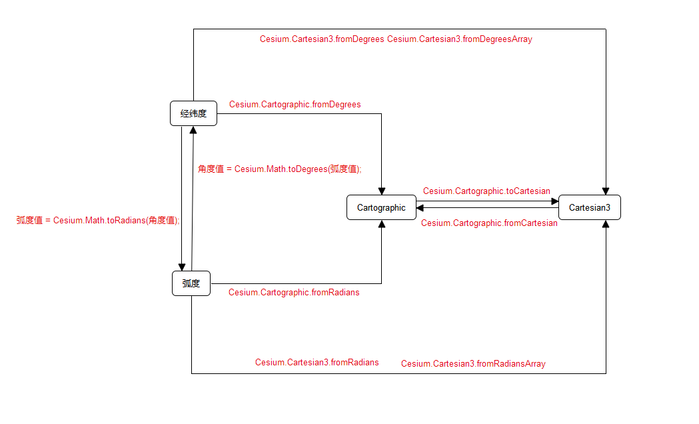

[reference link](https://www.cnblogs.com/aizai846/p/11846929.html)  
[reference link2](https://codeantenna.com/a/xzebC2PQ88) // 这个链接里的内容更好吸收
[reference link3](https://zhuanlan.zhihu.com/p/334540571)

# [JSdemo](./coordTrans.js){from reference link3}

# Cesium 中的坐标系/ Coordinates in Cesium
link1 gives 3, 
link3 gives 4, 
then i want to make it sure after i read over that book. 
current methods is enough to do sth. 
 
**!!只有转换到笛卡尔坐标系后!!**才能运用计算机图形学中的仿射变换知识进行空间位置变换如平移旋转缩放。 
&emsp;&emsp;Cesium为我们提供了如下几种很有用的变换工具类： 
&emsp;&emsp;&emsp;Cesium.Cartesian3（相当于Point3D） 
&emsp;&emsp;&emsp;Cesium.Matrix3（3x3矩阵，用于描述旋转变换） 
&emsp;&emsp;&emsp;Cesium.Matrix4（4x4矩阵，用于描述旋转加平移变换） 
&emsp;&emsp;&emsp;Cesium.Quaternion（四元数，用于描述围绕某个向量旋转一定角度的变换） 
&emsp;&emsp;&emsp;Cesium.Transforms(包含将位置转换为各种参考系的功能) 

<!-- # 依据 reference link2
一共三种坐标转换方式：
* 角度和弧度的转换
  在 Cesium 中Math对象中的函数可以用来完成角度和弧度之间的换算
  - 角度转弧度： 弧度值 = Cesium.Math.toRadians(角度值);
  - 弧度转角度： 角度值 = Cesium.Math.toDegrees(弧度值)
* 角度、弧度与 Cartesian3 的转换
  * 角度转换为 Cartesian3
  - Cesium.Cartesian3.fromDegrees
  - Cesium.Cartesian3.fromDegreesArray
  * 弧度转换为 Cartesian3
  - Cesium.Cartesian3.fromRadians
  - Cesium.Cartesian3.fromRadiansArray -->

